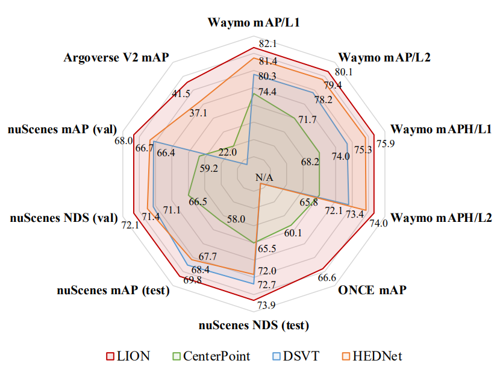

<div align="center">


### [LION: Linear Group RNN for 3D Object Detection in Point Clouds]()

[Zhe Liu](https://happinesslz.github.io) <sup>1,* </sup>,
[Jinghua Hou](https://github.com/AlmoonYsl) <sup>1,* </sup>,
[Xinyu Wang](https://github.com/deepinact) <sup>1,* </sup>,
[Xiaoqing Ye](https://shuluoshu.github.io)  <sup>3</sup>,
[Jingdong Wang](https://jingdongwang2017.github.io) <sup>3</sup>,
[Hengshuang Zhao](https://hszhao.github.io) <sup>2</sup>,
[Xiang Bai](https://xbai.vlrlab.net) <sup>1,✉</sup>
<br>
<sup>1</sup> Huazhong University of Science and Technology,
<sup>2</sup> The University of Hong Kong,
<sup>3</sup> Baidu Inc.
<br>
\* Equal contribution, ✉ Corresponding author.
<br>

**arXiv 2024**



</div>

[//]: # ([![arXiv]&#40;https://img.shields.io/badge/arXiv-xxx-red?logo=arXiv&logoColor=red&#41;]&#40;&#41;)


## 🔥 Highlights

* **Strong performance**. LION achieves state-of-the-art performance on Waymo, nuScenes, Argoverse V2, and ONCE datasets. 💪

* **Strong generalization**. LION can support almost all linear RNN operators including Mamba, RWKV, RetNet, xLSTM, and TTT. Anyone is welcome to verify more linear RNN operators. 😀

## News
* **2024.07.25**: LION paper released. 🔥
* **2024.07.02**: Our new works [OPEN](https://github.com/AlmoonYsl/OPEN) and [SEED](https://github.com/happinesslz/SEED) have been accepted by ECCV 2024. 🎉

## Results
* **Waymo Val Set**

| Model        | mAP/mAPH_L1 | mAP/mAPH_L2 |  Vec_L1   |  Vec_L2   |  Ped_L1   |  Ped_L2   |  Cyc_L1   |  Cyc_L2   | Config |
|--------------|:-----------:|:-----------:|:---------:|:---------:|:---------:|:---------:|:---------:|:---------:|:------:|
| LION-RetNet  |  80.9/78.8  |  74.6/72.7  | 79.0/78.5 | 70.6/70.2 | 84.6/80.0 | 77.2/72.8 | 79.0/78.0 | 76.1/75.1 |        |
| LION-RWKV    |  81.0/79.0  |  74.7/72.8  | 79.7/79.3 | 71.3/71.0 | 84.6/80.0 | 77.1/72.7 | 78.7/77.7 | 75.8/74.8 |        |
| LION-Mamba   |  81.4/79.4  |  75.1/73.2  | 79.5/79.1 | 71.1/70.7 | 84.9/80.4 | 77.5/73.2 | 79.7/78.7 | 76.7/75.8 |        |
| LION-Mamba-L |  82.1/80.1  |  75.9/74.0  | 80.3/79.9 | 72.0/71.6 | 85.8/81.4 | 78.5/74.3 | 80.1/79.0 | 77.2/76.2 |        |

* **NuScenes**

|    Model    | Split | NDS  | mAP  | Config | Download |
|:-----------:|:-----:|:----:|:----:|:------:|:--------:|
| LION-RetNet |  Val  | 71.9 | 67.3 |        |          |
|  LION-RWKV  |  Val  | 71.7 | 66.8 |        |          |
| LION-Mamba  |  Val  | 72.1 | 68.0 |        |          |
| LION-Mamba  | Test  | 73.9 | 69.8 |        |          |

* **Argoverse V2 Val Set**

|    Model    | mAP  | Config | Download |
|:-----------:|:----:|:------:|:--------:|
| LION-RetNet | 40.7 |        |          |
|  LION-RWKV  | 41.1 |        |          |
| LION-Mamba  | 41.5 |        |          |

* **ONCE Val Set**

|    Model    | Vehicle | Pedestrian | Cyclist | mAP  |  Config   | Download |
|:-----------:|:-------:|:----------:|:-------:|:----:|:---------:|:--------:|
| LION-RetNet |  78.1   |    52.4    |  68.3   | 66.3 |           |          |
|  LION-RWKV  |  78.3   |    50.6    |  68.4   | 65.8 |           |          |
| LION-Mamba  |  78.2   |    53.2    |  68.5   | 66.6 |           |          |


## Quick Validation
* We provide some examples of LION models on KITTI dataset for quick validation of any Linear RNN operators.
* Here, we provide the results of moderate difficulty for LION with RetNet, RWKV, Mamba, xLSTM, and TTT.
* Anyone is welcome to verify more linear RNN operators. 😀


|    Model    | Car  | Pedestrian | Cyclist |  Config  | Download |
|:-----------:|:----:|:----------:|:-------:|:--------:|:--------:|
|  LION-TTT   | 78.0 |    58.6    |  69.6   |          |          |
| LION-xLSTM  | 77.9 |    59.3    |  67.4   |          |          |
| LION-RetNet | 77.9 |    60.2    |  69.6   |          |          |
| LION-Mamba  | 78.3 |    60.2    |  68.6   |          |          |
|  LION-RWKV  | 78.3 |    62.2    |  71.2   |          |          |


## Installation
Please refer to [INSTALL.md](docs/INSTALL.md) for the installation of LION codebase.


## Getting Started
Please refer to [GETTING_STARTED.md](docs/GETTING_STARTED.md) to learn more usage about LION.

## TODO
- [x] Release the paper.
- [x] Release the code of LION on the Waymo.
- [x] Release the code of LION on the nuScenes.
- [x] Release the code of LION on the Argoverse V2.
- [x] Release the code of LION on the ONCE.
- [x] Release the code of LION on the KITTI.
- [ ] Release all checkpoints of LION.
- [ ] Support more linear RNNs.

## Citation
```
@article{
  liu2024lion,
  title={LION: Linear Group RNN for 3D Object Detection in Point Clouds},
  author={Liu, Zhe and Hou, Jinghua and Wang, Xinyu and Ye, Xiaoqing and Wang, Jingdong and Zhao, Hengshuang and Bai, Xiang},
  journel={},
  year={2024},
}
```

## Acknowledgements
We thank these great works and open-source repositories:
[OpenPCDet](https://github.com/open-mmlab/OpenPCDet), [DSVT](https://github.com/Haiyang-W/DSVT), [HEDNet](https://github.com/zhanggang001/HEDNet), [Mamba](https://github.com/state-spaces/mamba), [RWKV](https://github.com/BlinkDL/RWKV-LM), [Vision-RWKV](https://github.com/OpenGVLab/Vision-RWKV), [RMT](https://github.com/qhfan/RMT), [xLSTM](https://github.com/NX-AI/xlstm),  [TTT](https://github.com/test-time-training/ttt-lm-pytorch), and [flash-linear-attention](https://github.com/sustcsonglin/flash-linear-attention).
